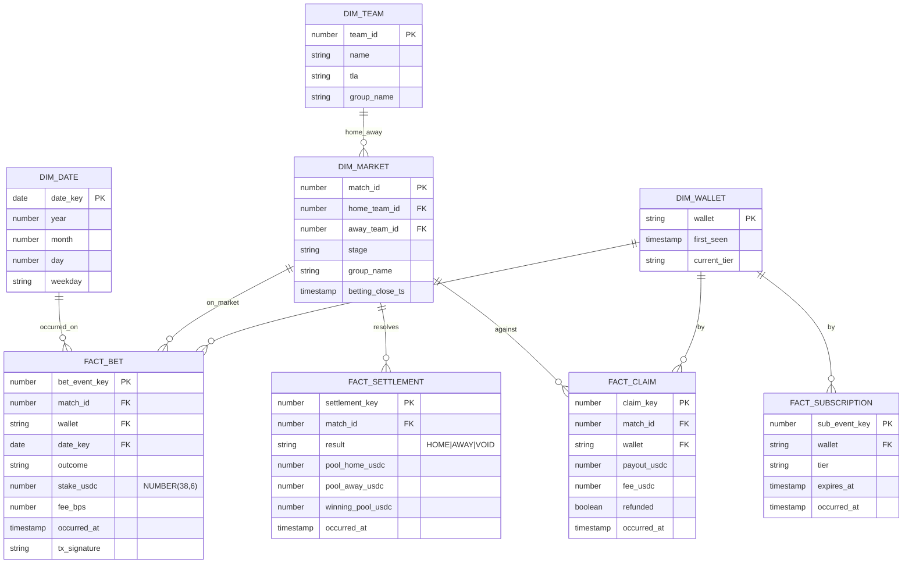
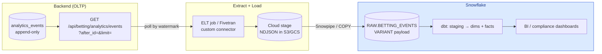

# Betting Analytics — Event Schema & Snowflake Readiness

How betting activity flows from the app into an analytical warehouse. The backend emits an
**append-only event log** today; a future ELT job lands it in **Snowflake**, where dbt models it
into a star schema for finance/compliance/product analytics.

> Status: the event log + emission + extraction API are **implemented and tested** in the backend.
> The Snowflake side (staging, dbt models) is **design only** — no warehouse is provisioned. See
> [`architecture.md`](./architecture.md) §11.1 for what is and isn't live.

---

## 1. Principles

| Principle | How it's applied |
|-----------|------------------|
| **OLTP stays source of truth** | SQLite/Postgres mirror + the Solana program own live state. The warehouse is a downstream, read-only sink. |
| **Append-only landing zone** | `analytics_events` is immutable — never updated/deleted. Corrections are new events. History is preserved for audit. |
| **Transactional emission** | `analytics.emit()` flushes in the *same transaction* as the mirror write, so an event exists iff its state change committed. |
| **Money is exact** | Amounts are integer **USDC base units** (6 dp) end-to-end. The warehouse casts to `NUMBER(38,6)`. No floats, ever. |
| **UTC everywhere** | `occurred_at` / `ingested_at` are naive UTC → Snowflake `TIMESTAMP_NTZ`. |
| **Monotonic watermark** | `event_id` is a monotonically increasing PK. ELT pulls `event_id > last_seen` — trivial incremental loads. |
| **Semi-structured payload** | `payload` is canonical JSON → Snowflake `VARIANT`. New fields don't require an OLTP migration. |
| **Idempotent** | A repeated `dedupe_key` (e.g. an indexer replaying an on-chain log) is a no-op. Safe re-processing. |
| **Versioned contract** | `schema_version` on every row lets the warehouse branch on payload shape over time. |

---

## 2. Raw event log (implemented)

Table `analytics_events` (`backend/app/models.py`). Written via `analytics.emit()`; read via
`GET /api/betting/analytics/events`.

| Column | Type (SQLite) | Snowflake landing type | Notes |
|--------|---------------|------------------------|-------|
| `event_id` | INTEGER PK | `NUMBER` | monotonic extraction watermark |
| `event_type` | TEXT | `STRING` | see catalogue §3 |
| `occurred_at` | DATETIME | `TIMESTAMP_NTZ` | when the business event happened |
| `ingested_at` | DATETIME | `TIMESTAMP_NTZ` | when the row was written |
| `schema_version` | INTEGER | `NUMBER` | payload contract version |
| `match_id` | INTEGER null | `NUMBER` | denormalised filter key |
| `wallet` | TEXT null | `STRING` | denormalised filter key |
| `tx_signature` | TEXT null | `STRING` | on-chain correlation / idempotency |
| `dedupe_key` | TEXT null, unique | `STRING` | idempotency key |
| `payload` | TEXT (JSON) | `VARIANT` | full event detail |

## 3. Event catalogue

| `event_type` | Emitted when | Key payload fields |
|--------------|--------------|--------------------|
| `MARKET_CREATED` | a market opens for a match | `match_id`, `home_team_id`, `away_team_id`, `betting_close_ts` |
| `BET_PLACED` | a stake is placed (grain = one placement) | `wallet`, `outcome`, `amount`, `fee_bps`, `new_pool_home`, `new_pool_away` |
| `MARKET_SETTLED` | oracle records the winner | `outcome`, `pool_home`, `pool_away`, `total_pool`, `winning_pool` |
| `MARKET_VOIDED` | draw / cancellation / empty winning pool | `pool_home`, `pool_away`, `total_pool` |
| `BET_CLAIMED` | winnings collected or stake refunded | `wallet`, `payout`, `fee`, `refunded` |
| `SUBSCRIPTION_CREATED` | subscribe / renew / upgrade | `wallet`, `tier`, `expires_at` |

All monetary payload fields are integer USDC base units.

---

## 4. Warehouse star schema (design)

dbt builds these from the raw log. `fact_*` grains are one row per business event.



**Example analytical questions this answers:** daily betting volume & fee revenue per market;
pool skew / implied-odds drift over the betting window; subscriber LTV and churn by tier; treasury
reconciliation (Σ `BET_PLACED` = Σ `BET_CLAIMED` payouts + fees, per settled market); AML flags
(wallet concentration, unusual stake velocity).

---

## 5. ELT flow (design)



Two viable load paths: **(a)** the watermark API above feeding a small custom job that writes NDJSON
to a cloud stage → Snowpipe/`COPY`; or **(b)** a CDC connector (Fivetran/Airbyte) replicating the
`analytics_events` table directly. Either way, `event_id` drives incremental loads.

---

## 6. Snowflake DDL (reference)

Landing table — one `VARIANT` column plus the extracted filter keys:

```sql
CREATE TABLE RAW.BETTING_EVENTS (
    event_id       NUMBER        NOT NULL PRIMARY KEY,
    event_type     STRING        NOT NULL,
    occurred_at    TIMESTAMP_NTZ NOT NULL,
    ingested_at    TIMESTAMP_NTZ NOT NULL,
    schema_version NUMBER        NOT NULL,
    match_id       NUMBER,
    wallet         STRING,
    tx_signature   STRING,
    payload        VARIANT       NOT NULL,
    _loaded_at     TIMESTAMP_NTZ DEFAULT CURRENT_TIMESTAMP()
);
```

Staging view — flatten the `VARIANT`, cast base units to decimal USDC:

```sql
CREATE OR REPLACE VIEW ANALYTICS.STG_BET_PLACED AS
SELECT
    event_id                              AS bet_event_key,
    match_id,
    wallet,
    occurred_at,
    occurred_at::DATE                     AS date_key,
    payload:outcome::STRING               AS outcome,
    payload:amount::NUMBER / 1000000      AS stake_usdc,   -- base units -> USDC
    payload:fee_bps::NUMBER               AS fee_bps,
    tx_signature
FROM RAW.BETTING_EVENTS
WHERE event_type = 'BET_PLACED';
```

Fact (dbt model `fact_bet.sql` would `SELECT * FROM {{ ref('stg_bet_placed') }}`):

```sql
CREATE OR REPLACE TABLE ANALYTICS.FACT_BET (
    bet_event_key NUMBER        PRIMARY KEY,
    match_id      NUMBER,
    wallet        STRING,
    date_key      DATE,
    outcome       STRING,
    stake_usdc    NUMBER(38,6),
    fee_bps       NUMBER,
    occurred_at   TIMESTAMP_NTZ,
    tx_signature  STRING
);
```

Incremental merge pattern (dbt `incremental` model, or raw SQL):

```sql
MERGE INTO ANALYTICS.FACT_BET t
USING ANALYTICS.STG_BET_PLACED s ON t.bet_event_key = s.bet_event_key
WHEN NOT MATCHED THEN INSERT (...) VALUES (...);
-- append-only source => no UPDATE branch needed.
```

---

## 7. Extraction API (implemented)

```
GET /api/betting/analytics/events?after_id=<n>&limit=<n>&event_type=<optional>
Header: X-Admin-Token
```

Returns events with `event_id > after_id`, ordered ascending. The caller persists the max
`event_id` it received and passes it as the next `after_id` — the only state the loader keeps.

---

## 8. Evolving the contract

- Adding a payload field → no migration; `VARIANT` absorbs it. Old rows simply lack the key.
- Changing/removing a field's meaning → bump `SCHEMA_VERSION` in `analytics.py`; dbt branches on it.
- New event type → add a constant in `analytics.py`, emit it, add a staging model. Existing
  consumers ignore unknown types.
