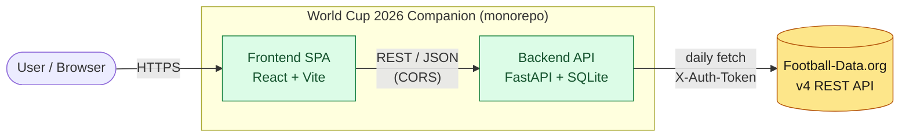
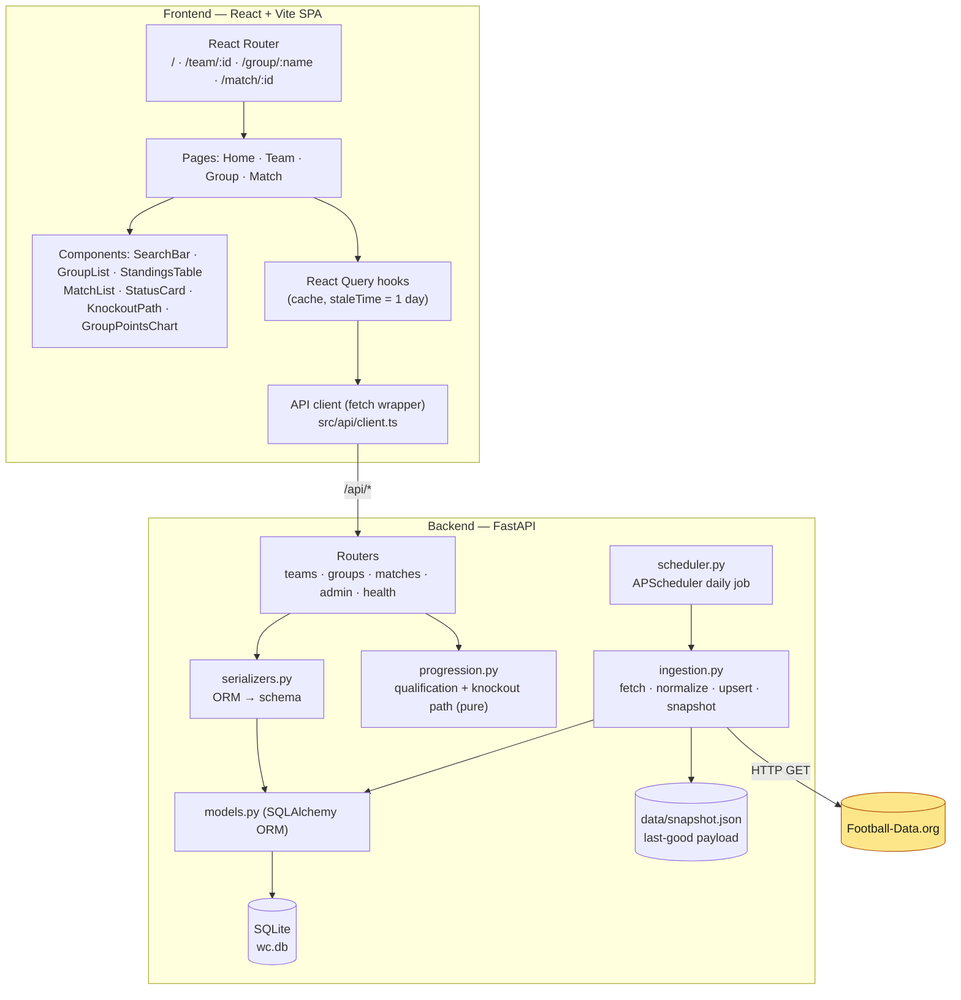
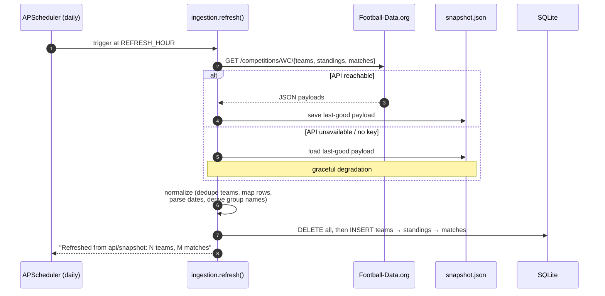
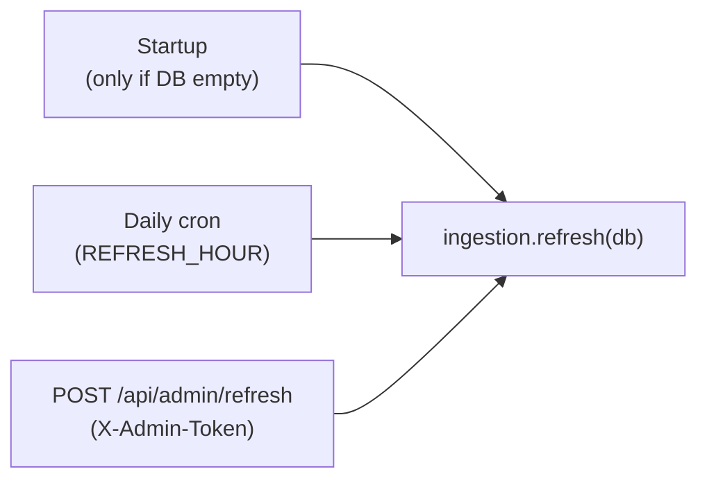
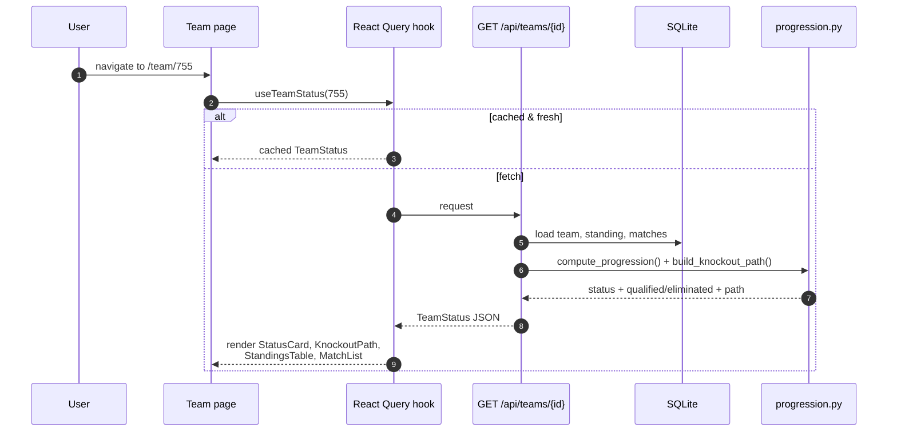
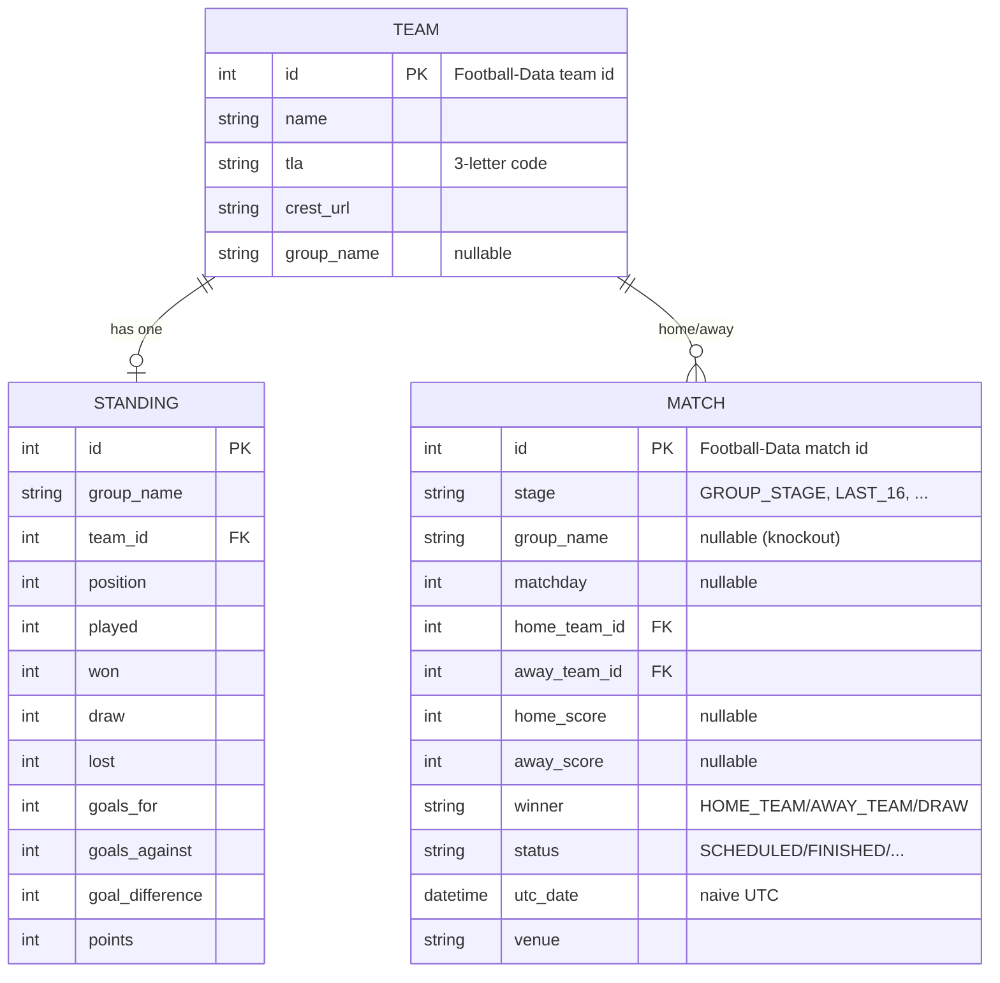
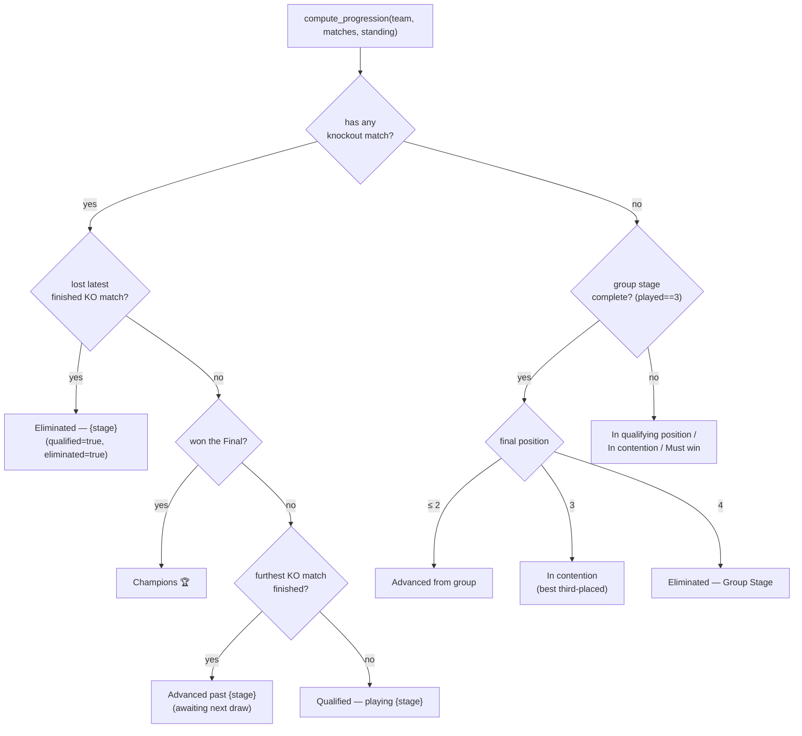
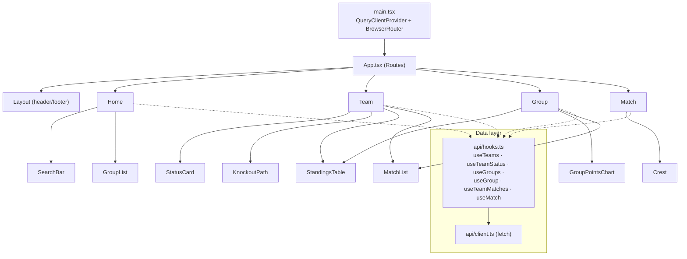
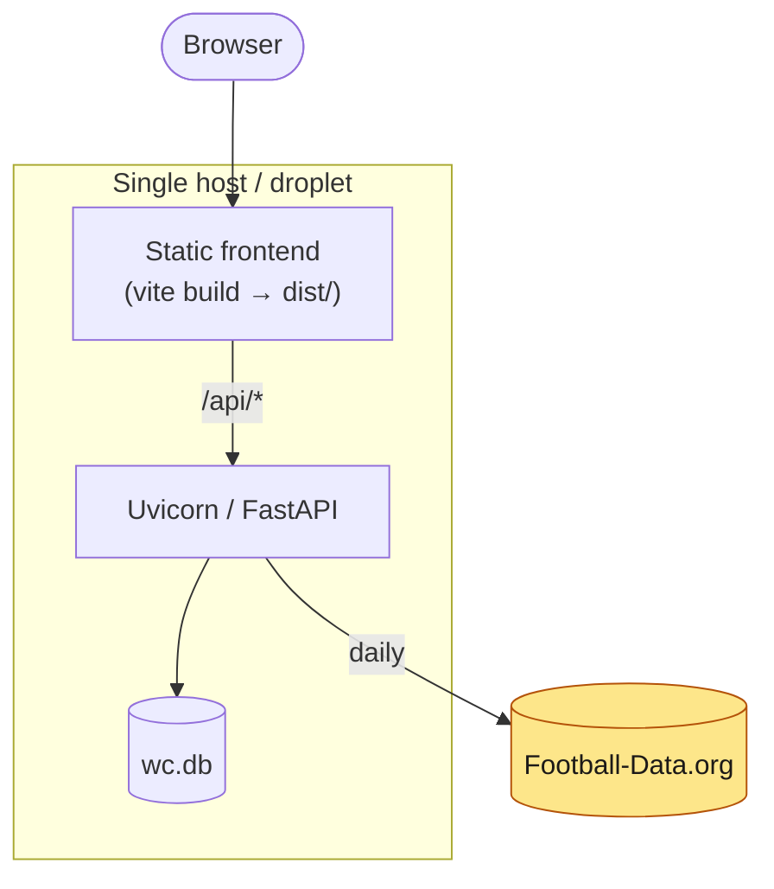

# Architecture — World Cup 2026 Companion App

This document describes how the app is put together: its components, how data flows through the
system, the data model, and the runtime request paths. Diagrams use [Mermaid](https://mermaid.js.org/)
and render natively on GitHub and in most Markdown viewers.

---

## 1. Overview

A lightweight web app where a user picks a country and sees its **FIFA World Cup 2026** status —
group standings, progression, results, and upcoming fixtures. Tournament data is refreshed **once
per day** from a free football API; there is no live/real-time data.

- **Backend:** FastAPI + SQLite (SQLAlchemy 2.0), ingesting from Football-Data.org.
- **Frontend:** React + Vite + TypeScript, TailwindCSS, React Query, Recharts.
- **Shape:** a monorepo with a clean REST boundary between `backend/` and `frontend/`.

**Design principle — derive, don't recompute.** Qualification and knockout progression are read
from the *actual* matches feed (a team with a scheduled or won knockout match has advanced; a team
that lost its latest knockout match is out). We deliberately do **not** reimplement FIFA's
"8 best third-placed teams" algorithm. Group-stage labels are lightweight heuristics used only
while the group stage is live.

---

## 2. System context

How the app sits between the user and the upstream data provider.

The frontend never talks to Football-Data.org directly — the backend is the only component holding
the API key, and it caps upstream traffic to a few calls per day.

---

## 3. Container / component view

The two deployables and the responsibilities inside each.

**Backend module responsibilities**

| Module | Responsibility |
| ------ | -------------- |
| `main.py` | App factory, CORS, router mounting, lifespan (startup ingest + scheduler) |
| `config.py` | `pydantic-settings` config from `.env` (API key, competition code, refresh hour, CORS) |
| `database.py` | SQLAlchemy engine/session, `Base`, `init_db()` |
| `models.py` | ORM entities: `Team`, `Standing`, `Match` |
| `schemas.py` | Pydantic response models (the API contract) |
| `ingestion.py` | Football-Data client → normalize → replace-and-reload; snapshot save/fallback |
| `progression.py` | Pure functions: `compute_progression`, `build_knockout_path`, `humanize_stage` |
| `serializers.py` | ORM → schema conversion shared across routers |
| `scheduler.py` | APScheduler `AsyncIOScheduler` daily refresh job |
| `routers/` | `teams`, `groups`, `matches`, `admin` endpoints |

---

## 4. Daily update workflow

How fresh data gets into the database — on a schedule, at startup, or on demand.

The same `refresh()` routine has three triggers:

Ingestion uses a **replace-and-reload** strategy (delete all rows, re-insert the normalized
payload) — simple and correct at this data scale (48 teams, ~104 matches).

---

## 5. Read request flow

What happens when a user opens a team page. React Query caches each response for a day, so repeat
navigation is served from memory.

**API surface**

| Method | Path | Purpose |
| ------ | ---- | ------- |
| GET | `/api/health` | Liveness check |
| GET | `/api/teams?q=` | List / search teams |
| GET | `/api/teams/{id}` | Team status (standing, qualification, knockout path, upcoming) |
| GET | `/api/groups` | All groups with standings |
| GET | `/api/groups/{name}` | Group standings + remaining fixtures |
| GET | `/api/matches/team/{id}` | A team's past + upcoming matches |
| GET | `/api/matches/{id}` | Single match detail |
| POST | `/api/admin/refresh` | Manual re-ingest (requires `X-Admin-Token`) |

---

## 6. Data model

Three tables. `Standing` and `Match` reference `Team`; groups are represented as a string on both
`Team` and `Standing` (no separate table needed).

> **Note on datetimes:** SQLite stores `utc_date` as a **naive** timestamp. All server-side
> time comparisons therefore use a naive-UTC "now"
> (`datetime.now(timezone.utc).replace(tzinfo=None)`) to avoid naive-vs-aware `TypeError`s.

---

## 7. Progression logic

How a team's human-readable status is derived. Knockout truth comes from the matches feed; the
group-stage branch is a lightweight heuristic.

---

## 8. Frontend structure

State management is intentionally minimal: **React Query** owns all server state (fetching,
caching, loading/error), and there is no separate global store. `staleTime` is one day, matching
the daily refresh cadence.

---

## 9. Deployment view

The MVP targets a single host (concept §9 names Digital Ocean). The frontend builds to static
assets; the backend runs Uvicorn with a local SQLite file.

Because ingestion is a scheduled pull with a JSON snapshot fallback, the app keeps serving the
last-good data even if the upstream API is briefly unavailable.

---

## 10. Key decisions & trade-offs

| Decision | Rationale | Trade-off |
| -------- | --------- | --------- |
| Derive progression from the matches feed | Avoids reimplementing FIFA's best-third-placed algorithm; matches the real bracket | Group-stage labels before the bracket exists are heuristic |
| Replace-and-reload ingestion | Simple, always consistent | Not incremental — fine at 48-team scale, not for large datasets |
| SQLite + single daily refresh | Zero infra, matches "daily static update" scope | Not suited to live/real-time data |
| React Query only (no Redux) | Server state is the only meaningful state | Little benefit if the app later needs rich client state |
| Snapshot fallback | Dev works offline; resilient to API outages | Snapshot can be stale if the API is down for long |
